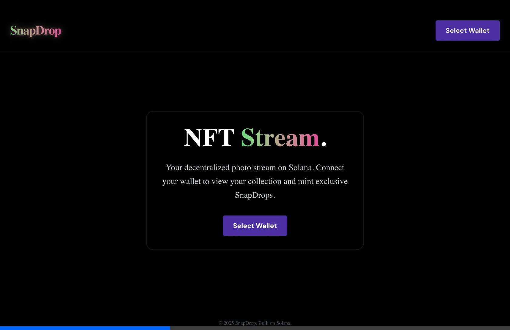

# SnapDrop

> Snapshot your moments as NFTs on Solana.



## 🚀 Overview
SnapDrop is a decentralized application (dApp) built on Solana that allows users to:
- **Connect Wallet**: Seamlessly integrate with Solana wallets.
- **View Gallery**: Visualize your owned NFTs in a sleek, animated stream.
- **Mint NFTs**: Participate in random NFT drops via Candy Machine.

## ✨ Features
- **Dynamic UI**: Responsive design with neon aesthetics and smooth animations.
- **Solana Integration**: Powered by Metaplex Candy Machine and Umi.
- **Instant Minting**: One-click minting experience.

## 🛠 Tech Stack
- **Frontend**: Next.js 15, React 19, TailwindCSS v4
- **Blockchain**: Solana Web3.js, Metaplex Umi
- **State Management**: React Context, Wallet Adapter

## 📦 Getting Started

1. **Install dependencies**:
   ```bash
   npm install
   ```

2. **Run the development server**:
   ```bash
   npm run dev
   ```

3. **Open** [http://localhost:3000](http://localhost:3000)

## 🚢 Deployment
Configured for GitHub Pages. See `DEPLOY.md`.
